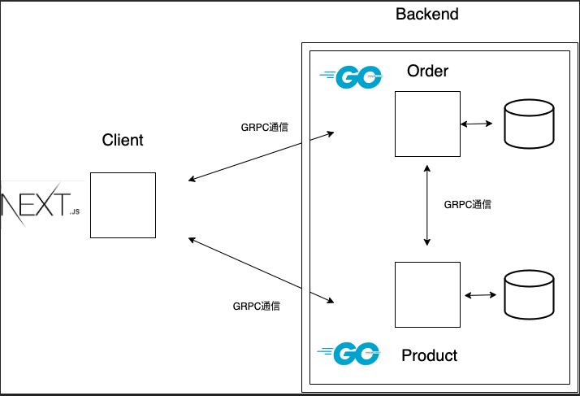

# grpc + microservices

orderとproductを疎結合にさせ、grpc経由でデータの受け渡しをする構成。

## 構成

clientにNextJS、backendにgoを採用。



## pb.go作成

```
make set-order-proto
make set-product-proto
```

## npm install

```
make npm-install
```


## npm 起動

```
make npm-dev
```

## docker ビルド


```
make build
```

## docker 起動

```
make up
```

# todo

Envoy Proxy + GraphQL + GRPC